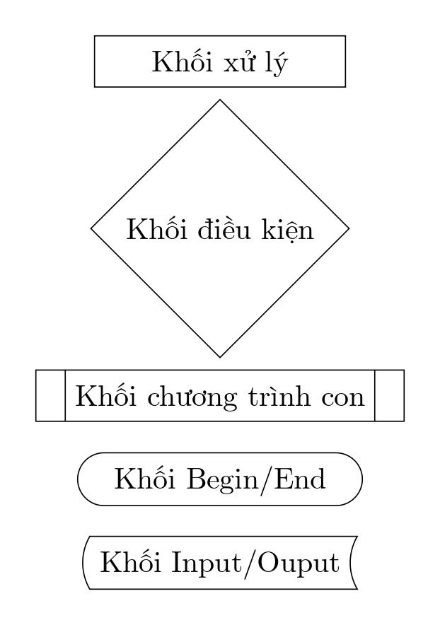
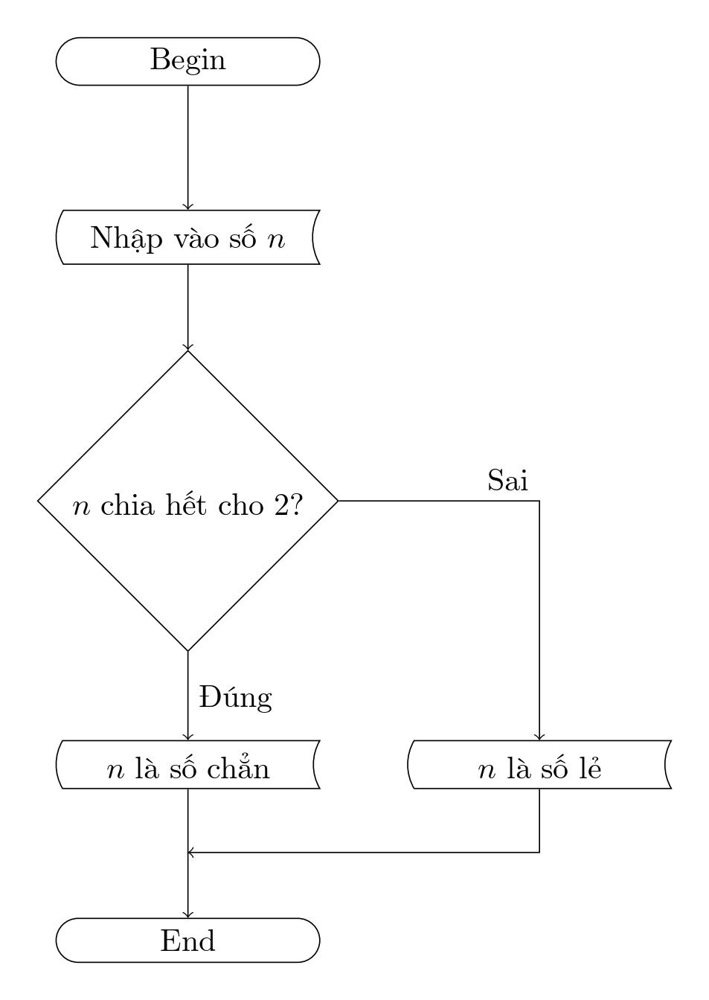

# Vẽ lưu đồ giải thuật với package flowchart

- **Thực hiện:** Thi Minh Nhựt - **Email:** thiminhnhut@gmail.com

- **Thời gian:** Ngày 08 tháng 11 năm 2021

---

## Giới thiệu

- Lưu đồ giải thuật là công cụ dùng để mô tả thuật toán, dữ liệu vào, dữ liệu ra, luồng xử lý dữ liệu thông qa các ký hiệu hình học.

- Để vẽ lưu đồ giải thuật trong LaTeX, chúng ta có thể sử dụng package `flowchart`. Package `flowchart` hỗ trợ các ký hiệu chuẩn như sau:

  

  - Source mẫu: [flowchart_symbols.tex](https://github.com/thiminhnhut/latex/tree/master/flowchart/flowchart_symbols.tex) - [flowchart_symbols.pdf](https://github.com/thiminhnhut/latex/tree/master/flowchart/flowchart_symbols.pdf)

## Cách sử dụng

- Khai báo package:

  ```latex
  \usepackage{flowchart}
  \usetikzlibrary{arrows}
  ```

- Vẽ các khối trong môi trường `tikzpicture`:

  ```latex
  \begin{tikzpicture}[>=latex']
  % Vẽ cách khối của lưu đồ ở đây
  \end{tikzpicture}
  ```

- Ví dụ: [example01.tex](https://github.com/thiminhnhut/latex/tree/master/flowchart/example01.tex) - [example01.pdf](https://github.com/thiminhnhut/latex/tree/master/flowchart/example01.pdf)

  - Lưu ý đặt tên riêng (có tính gợi nhớ) cho mỗi khối trên lưu đồ để chúng ta vẽ các mũi tên, nối các khối trên lưu đồ với nhau.

    

- Để dễ quản lý và tái sử dụng lại, chúng ta thực hiện như sau:

  - Code vẽ lưu đồ giải thuật trong một file riêng (sử dụng document class là `standalone` như ví dụ `example01.tex`)

  - Chèn file code đã vẽ ở file `example01.tex` vào file tài liệu chính: [main_example_01.tex](https://github.com/thiminhnhut/latex/tree/master/flowchart/main_example_01.tex)

    - _Lưu ý: khi build file `main_example_01.tex` nếu xảy ra lỗi thì xóa file `main_example_01.sta` và thực hiện build lại_.
