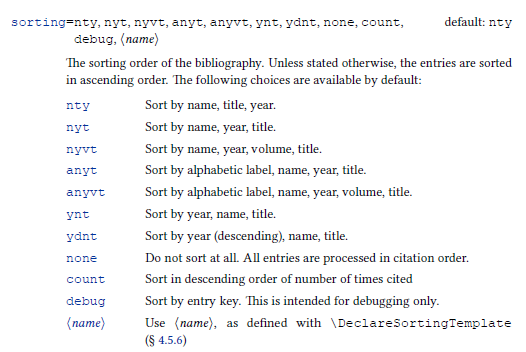

# Quản lý tài liệu tham khảo trong LaTeX

- **Thực hiện:** Thi Minh Nhựt - Email: thiminhnhut@gmail.com

- **Thời gian:** Ngày 07 tháng 04 năm 2022

---

## Một số cách quản lý tài liệu tham khảo trong LaTeX

1. Sử dụng môi trường `thebibliography`:

   - Định dạng nội dung hiển thị của tài liệu tham khảo thủ công.

   - Cách này thích hợp cho việc tạo danh sách và hiển thị tài liệu tham khảo mà chưa cần tham chiếu đến tài liệu tham khảo.

1. Sử dụng package `biblatex`:

   - Định dạng nội dung hiển thị của tài liệu tham khảo được tự động theo các option của package `biblatex`.

   - Cách này sử dụng phù hợp cho việc tạo danh sách và hiển thị tài liệu tham khảo có tham chiếu trong tài liệu (chỉ những tài liệu nào được tham chiếu trong tài liệu thì mới hiển thị trong danh sách tài liệu tham khảo).

   - Cách sử dụng:

     ```latex
     % Khai báo sử dụng package biblatex
     \usepackage[backend=biber,style=numeric,sorting=ynt]{biblatex}
     \addbibresource{references.bib}
     ```

     - `backend=biber`: sử dụng `biber` backend để hiển thị tài liệu tham khảo.

     - `sorting` option:

       

       nếu `sorting=none` thì nội dung hiển thị của tài liệu tham khảo sẽ được hiển thị như thứ tứ được sắp xếp trong file `references.bib` (không tự động sắp xếp).

     - Chuẩn bị nội dung của phần tài liệu tham khảo trong file `references.bib` (tham khảo trong file [references.bib](https://github.com/thiminhnhut/latex/blob/master/references-and-citations/biblatex/examples/references.bib)).

     - Cách hiển thị tài liệu tham khảo trong tài liệu:

       ```latex
       \printbibliography[heading=bibintoc,title={Whole bibliography}]
       ```

       - Nếu không muốn in ra `heading` của tài liệu tham khảo thì sử dụng `heading=none`.

       - Nếu muốn thêm tài liệu tham khảo vào mục lục thì sử dụng `heading=bibintoc`.

       - `title={My bibliography title}`: tên của tài liệu tham khảo.

     - Cách build tài liệu khi sử dụng package `biblatex` với `biber` backend:

       ```bash
       biber --cache
       pdflatex main
       biber main # Theo dõi lỗi và sửa lỗi nếu có ở command này
       pdflatex main
       pdflatex main
       ```
