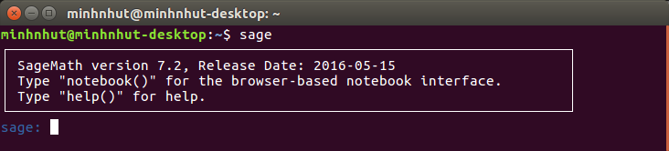
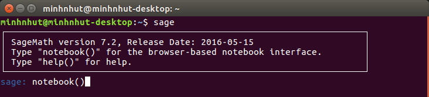
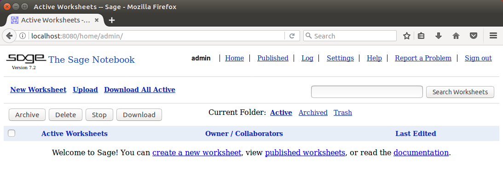

# Sử dụng Sage trong LaTeX với gói lệnh sagetex

Thực hiện: Thi Minh Nhựt - Email: thiminhnhut@gmail.com

Thời gian: Ngày 31 tháng 01 năm 2017

## Tài liệu học Sage và SageTeX

1. [SageMath - Download for Linux](http://www.sagemath.org/download-linux.html)
   của [sagemath.org](http://www.sagemath.org/)

2. [Ubuntu Documentation - Sage](https://help.ubuntu.com/community/SAGE)

3. [Sage Tutorial](http://doc.sagemath.org/html/en/tutorial/) của
   [sagemath.org](http://www.sagemath.org/)

4. [Using SageTeX](http://doc.sagemath.org/html/en/tutorial/sagetex.html) trong
   mục [Documentation](http://doc.sagemath.org/) của
   [sagemath.org](http://www.sagemath.org/)

## Cài đặt SageMath

- Vào mục [Download](http://www.sagemath.org/download.html) của
  [SageMath](http://www.sagemath.org/), chọn phiên bản phù hợp với hệ điều hành
  và làm theo hướng dẫn. Ví dụ cách cài đặt `SageMath` cho hệ điều hành Ubuntu.

- **Cài đặt SageMath cho hệ điều hành Ubuntu:**

  - Thực hiện cài đặt từ `PPA`:

    ```bash
    sudo -E apt-add-repository -y ppa:aims/sagemath
    sudo -E apt-get update
    sudo -E apt-get install sagemath-upstream-binary
    ```

- **Sử dụng SageMath**:

  - Mở `SageMath`:

    - Mở `SageMath`, thực hiện tính toán với chế độ dòng lệnh: `command line`.

      - Gõ lệnh:

        ```bash
        sage
        ```

      - Sau lệnh `sage`, sẽ xuất hiện như sau:

        sage:

        Được giao diện như hình bên dưới, thực hiện gõ lệnh vào đây:

        

    - Thao tác ở chế độ `GUI` với `notebook`:

      - Gõ lệnh:

        ```bash
        sage
        ```

      - Gõ tiếp `notebook()`:

        ```bash
        sage: notebook()
        ```

        

      - Nhập mật khẩu 2 lần nếu lần đầu sử dụng và copy địa chỉ dán vào trình
        duyệt web:

        ```bash
        http://localhost:8080
        ```

        

      - Chọn tab `Help` để đọc hướng dẫn sử dụng.

- **Làm cho SageTeX biết TeX:**

  - Tìm thư mục chứa file `sagetex.sty`, dùng lệnh `find`:

    ```bash
    $ sudo find / -name sagetex.sty
    /usr/lib/sagemath/local/share/texmf/tex/latex/sagetex/sagetex.sty
    ```

  - Nếu trong thư mục `$HOME` (nghĩa là thư mục `/home/username`, với `username`
    là tên người dùng máy tính), chưa có thư mục `texmf` thì khởi tạo nó:

    ```bash
    mkdir $HOME/texmf
    ```

  - Copy tất cả các thư mục và file trong `/usr/lib/sagemath/local/share/texmf/`
    đến thư mục `$HOME/texmf/`:

    ```bash
    sudo cp -r /usr/lib/sagemath/local/share/texmf/\* $HOME/texmf/
    ```

  - Làm cho TeX biết sự thay đổi này:

    ```bash
    sudo texhash $HOME/texmf/
    ```

## Cách sử dụng gói lệnh sagetex

- Khai báo gói lệnh `sagetex` trong tài liệu `LaTeX`, khai báo trước
  `\begin{document}`:

  ```latex
  \usepackage{sagetex}
  ```

- Các lệnh có trong gói lệnh `sagetex`:

  - Xem tài liệu về gói lệnh `sagetex` trên máy tính:

    ```bash
    $ ls /usr/lib/sagemath/local/share/doc/sagetex/
    example.pdf example.tex sagetex.pdf
    ```

    - File `sagetex.pdf`: file hướng dẫn sử dụng các lệnh trong gói lệnh `sagetex`.

    - File `example.tex`: file ví dụ về cách nhúng mã `sage` vào tài liệu soạn
      bằng LaTeX.

    - File `example.tex`: file kết quả mô tả về nhúng mã `sage` vào tài liệu
      soạn bằng LaTeX.

  - Mở file `sagetex.pdf` để xem tài liệu hướng dẫn:

    ```bash
    evince /usr/lib/sagemath/local/share/doc/sagetex/sagetex.pdf
    ```

  - Đọc file hướng dẫn `sagetex.pdf` để biết cách sử các lệnh, kết hợp thực hành
    với file `example.tex`.

- Biên dịch một file `.tex` có nhúng mã `sage`. Quy trình biên dịch:
  `PDF LaTeX - Sage - PDF LaTeX - View PDF`.

  - Ví dụ, file tex là `$HOME/example/example.tex`.

    - Phần hướng dẫn bên dưới, tôi sử dụng đường dẫn đầy đủ để mô tả rõ ràng.
      Các bạn có thể sử dụng `TeXMaker` để soạn thảo và biên dịch tài liệu cho
      dễ dàng hơn.

    - Khi thực hành các bạn chỉ cần mở cửa sổ Terminal trong thư mục chứa file
      `example.tex`. Thực hiện lệnh ngắn gọn là được:

      ```bash
      sage example.sagetex.sage
      ```

      Xem thêm cách để mở của sổ Terminal ngay tại thư mục làm việc khi click
      chuột phải trong hệ điều hành Ubuntu:
      [Cách thực hiện](https://github.com/thiminhnhut/ubuntu/blob/master/tips/open-terminal-here/open-terminal-here.md)

      Nếu bạn sử dụng `TeXMaker` để soạn thảo và biên dịch thì vào menu `Tools/Open Terminal`
      để mở của sổ Terminal đến thư mục làm việc và thực hiện lệnh trên (lệnh `sage`).

    - Nếu bạn sử dụng chương trình TeXMaker để soạn thảo tài liệu LaTeX, bạn có
      thể nhúng cách biên dịch tài liệu có chứa mã `sage` trực tiếp vào chương
      trình TeXMaker:
      [Cách thực hiện](https://github.com/thiminhnhut/latex/tree/master/sagetex/sage-texmaker.md)

  - Biên dịch file `example.tex` lần thứ nhất với `PDF LaTeX`.

    ```bash
    pdflatex $HOME/example/example.tex
    ```

  - Dùng lệnh `sage` để chạy file `example.sagetex.sage` (cần chỉ đến thư mục
    chứa file soạn thảo tài liệu LaTeX `example.tex`):

    ```bash
    sage $HOME/example/example.sagetex.sage
    ```

  - Xuất hiện thông báo bên dưới là biên dịch file `.sage` thành công:

    ```bash
    Sage processing complete. Run LaTeX on learning-latex.tex again.
    ```

  - Biên dịch lại file `example.tex` một lần thứ 2 với `PDF LaTeX`

    ```bash
    pdflatex $HOME/example/example.tex
    ```

  - Kết quả tính toán tự động được chèn vào tài liệu.
