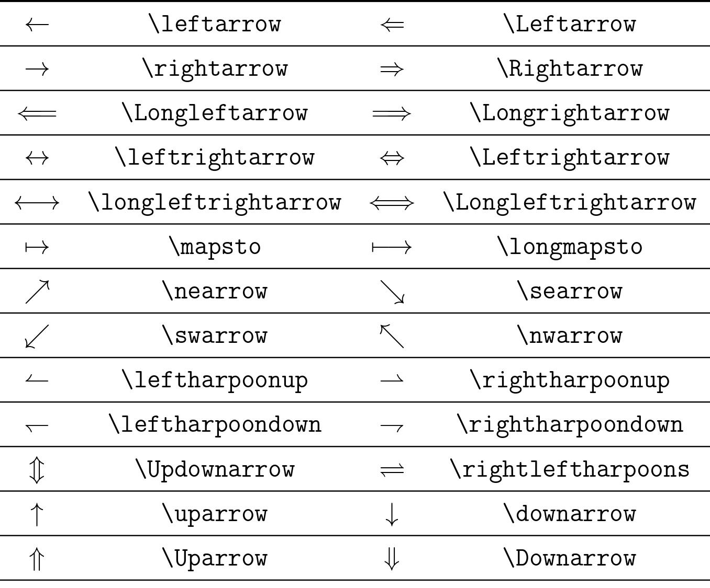

# Soạn thảo các dấu mũi tên trong LaTeX

- **Thực hiện:** Thi Minh Nhựt - **Email:** thiminhnhut@gmail.com

- **Thời gian:** Ngày 01 tháng 11 năm 2021

---

## Các ký tự Hy Lạp

- Source: [arrow.tex](https://github.com/thiminhnhut/latex/tree/master/tutorials/arrow/arrow.tex)

  
