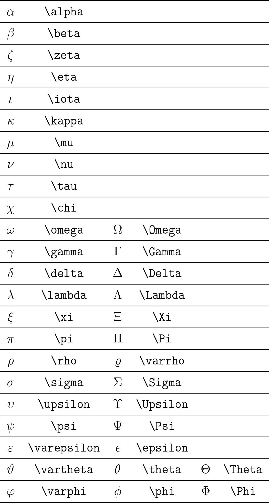

# Soạn thảo ký tự Hy Lạp toán trong LaTeX

- **Thực hiện:** Thi Minh Nhựt - **Email:** thiminhnhut@gmail.com

- **Thời gian:** Ngày 30 tháng 10 năm 2021

---

## Các ký tự Hy Lạp

- Source: [greek_letters.tex](https://github.com/thiminhnhut/latex/tree/master/tutorials/greek-letters/greek_letters.tex)

- Ví dụ: để gõ ký tự `\alpha` thì ta gõ: `$\alpha$` hoặc `\(\alpha\)` (đặt command trong cặp dấu `$$` hoặc `\(\)`).

  
