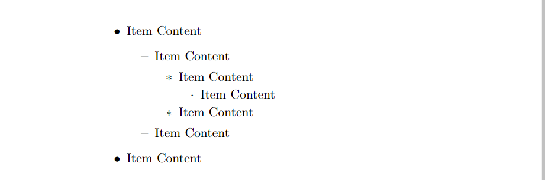
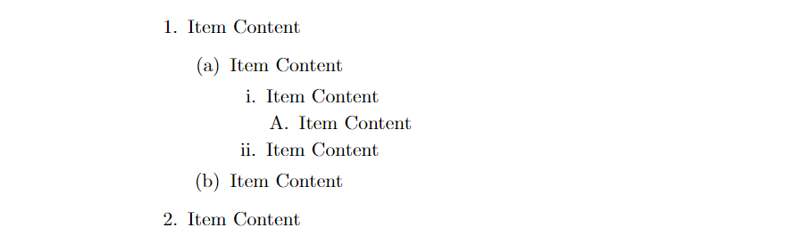

# Tạo danh sách trong LaTeX

- **Thực hiện:** Thi Minh Nhựt - **Email:** thiminhnhut@gmail.com

- **Thời gian:** Ngày 13 tháng 08 năm 2020

---

## Danh sách không đánh số

- Sử dụng các môi trường `itemize` lồng ghép vào nhau (tối đa sử dụng được 4 cấp).

  ```tex
  \begin{itemize}
    \item Item Content
          \begin{itemize}
            \item Item Content
                  \begin{itemize}
                    \item Item Content
                          \begin{itemize}
                            \item Item Content
                          \end{itemize}
                    \item Item Content
                  \end{itemize}
            \item Item Content
          \end{itemize}
    \item Item Content
  \end{itemize}
  ```

  

## Danh sách có đánh số

- Sử dụng các môi trường `itemize` lồng ghép vào nhau (tối đa sử dụng được 4 cấp).

  ```tex
  \begin{enumerate}
    \item Item Content
          \begin{enumerate}
            \item Item Content
                  \begin{enumerate}
                    \item Item Content
                          \begin{enumerate}
                            \item Item Content
                          \end{enumerate}
                    \item Item Content
                  \end{enumerate}
            \item Item Content
          \end{enumerate}
    \item Item Content
  \end{enumerate}
  ```

  

- Thay đổi label của môi trường `enumerate`.

  - Cú pháp:

    ```tex
    \renewcommand{\theenumi}{\alph{enumi}}
    ```

  - Giải thích:

    - `theenumi` và `enumi`: môi trường enumerate cho cấp 1.

    - `theenumii` và `enumii`: môi trường enumerate cho cấp 2.

    - `theenumiv` và `enumiv`: môi trường enumerate cho cấp 3.

    - `theenumiv` và `enumiv`: môi trường enumerate cho cấp 4.

    - Phần format cách đánh số `{\alph{enumi}}`.

      - `\alph{counter}`: đánh số `a, b, c,...`

      - `\Alph{counter}`: đánh số `A, B, C,...`

      - `\arabic{counter}`: đánh số `1, 2, 3,...`

      - `\roman{counter}`: đánh số `i, ii, iii,...`

      - `\Roman{counter}`: đánh số `I, II, III,...`

## Lồng ghép giữa hai môi trường Itemize và Enumerate

- Sử dụng kết hợp giữa hai môi trường `itemize` và `enumerate` để tạo ra danh sách theo ý của tác giả:

  ```tex
    \begin{enumerate}
      \item Item Content
            \begin{itemize}
              \item Item Content
            \end{itemize}
      \end{enumerate}
  ```

  

## Không muốn tạo label hoặc thay đổi label cho một số item nhất định

- Không muốn đánh số cho `item`, sử dụng `\item[]`:

  ```tex
  \begin{itemize}
    \item Item Content
    \item[] Item Content
    \item Item Content
  \end{itemize}
  ```

  

- Không muốn đánh số cho `item`, sử dụng `\item[New Label]`:

  ```tex
  \begin{itemize}
    \item Item Content
    \item[$\times$] Item Content
    \item Item Content
  \end{itemize}
  ```

  lệnh `\item[$\times$]` tạo ra label mới.

  
