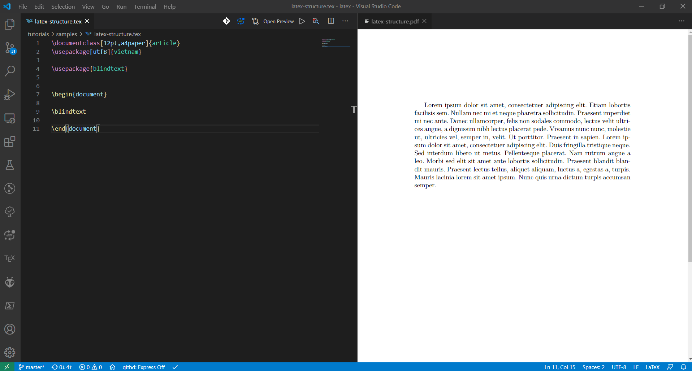

# Cài đặt IDE VSCode để lập trình LaTeX

- **Thực hiện:** Thi Minh Nhựt - **Email:** thiminhnhut@gmail.com

- **Thời gian:** Ngày 11 tháng 08 năm 2020

---

## Cài đặt IDE VSCode

[Download VSCode](https://code.visualstudio.com/)

## Cài đặt các extension cho VSCode để lập trình LaTeX

1. LaTeX Workshop

1. .gitignore Generator

## Sử dụng IDE VSCode để biên dịch file LaTeX ra PDF

- Lệnh biên dịch: `Ctrl + Alt + B`.

- Xem kết quả ở file PDF: `Ctrl + Alt + V`.

  

- Lựa chọn cách build file LaTeX ra PDF, đặt một trong những macro này ở đầu file tex.

  ```tex
  % !TEX program = latexmk
  % !TEX program = pdflatex
  % !TEX program = xelatex
  ...
  ```
